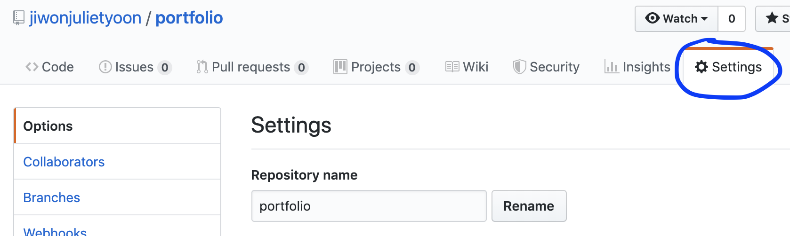
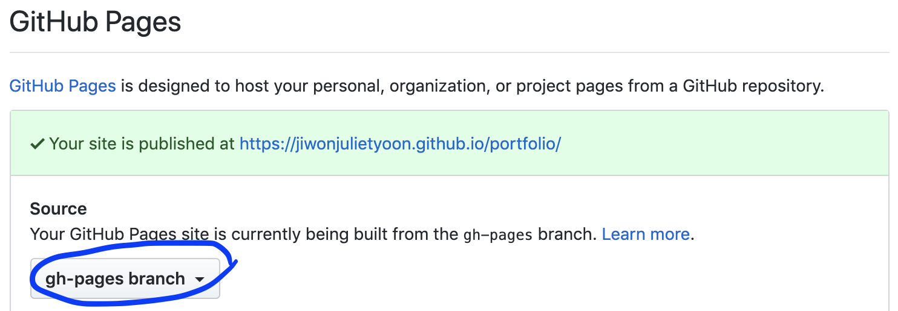

# Deploying Vue CLI project to GitHub Pages

> In my case:
>
> - GitHub username: `jiwonjulietyoon`
> - Name of repository (Vue CLI project) to deploy: `portfolio`
>   - => <https://github.com/jiwonjulietyoon/portfolio>
> - (Result) URL of deployed GitHub page: <https://jiwonjulietyoon.github.io/portfolio/>

<br>

#### Step 1) In local project repository:

1. Create a new local branch named `gh-pages` ==> `git checkout -b gh-pages`

2. In the root directory of the project (same level as `public/` and `src/`), create a new file named `vue.config.js`, and copy & paste the following code:

   ```javascript
   module.exports = {
     publicPath: 'portfolio'
   }
   ```

3. In `.gitignore`, comment out the line that includes `dist/`. 

   - `dist/` is included in `.gitignore` by default, so make sure to *comment* this part to *cancel* gitignore.

4. Run `npm run build`. This will create the `dist/` folder.

5. Make sure you have NOT committed the modified `.gitignore` and `vue.config.js` files.

   - `dist/` and `vue.config.js` need NOT be pushed to the `master` branch

6. Run `git add dist && git commit -m "Initial dist subtree commit`.

7. Run `git subtree push --prefix dist origin gh-pages`.

   - Check GitHub to make sure that the `gh-pages` branch of your repository now has css, img, js folders and index.html, favicon.ico files (instead of public, src, and other Vue CLI files)

#### Step 2) In GitHub repository:

1. Go to respository settings.

   

2. Scroll down to the GitHub Pages section (towards the bottom), and select `gh-pages branch` as the Source.

   

3. Done!

<br>

<br>

### Afterwards...

1. Checkout to master branch.
2. Add `dist/` and `vue.config.js` to `.gitignore` (uncomment `dist/`)
3. Any changes made to project code should be push to the master branch, as normal.
4. When further deploying such changes to GitHub Pages, repeat the following steps:
   1. Run `git checkout gh-pages` and then `git pull origin master`
   2. Comment out `dist/` and `vue.config.js` in `.gitignore`
   3. Run `npm run build`
   4. Run `git add dist && git commit -m "Deploy"`
   5. Run `git subtree push --prefix dist origin gh-pages`

