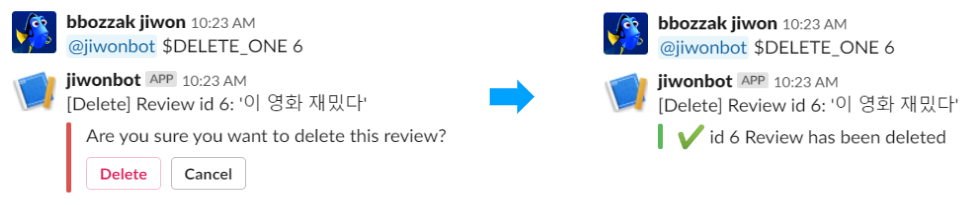

# Slack Interactive Components with Python and Flask

Goal: Building a Slackbot that offers interactive elements (buttons, dropdown lists, etc.) and performs follow-up actions depending on the user's selection. Interactive buttons and dropdown lists greatly enhances user experience compared to the Slackbot just responding in plain text :)

<br>

### Background

Let's say that I have a Slackbot that can perform data CRUD upon user command. For example, if I were to input `@bot $DELETE 5`, the mentioned Slackbot would delete the data record where the id is `5`. (In the code demonstration below, `data` specifically refers to movie reviews written in text format.)

But, instead of my Slackbot deleting the data right away, I want it to ask the user for further confirmation by offering a set of buttons -- 'Confirm Delete' and 'Cancel Delete.' The bot will delete the specified data only if the user clicks on the 'Confirm Delete' button.

<br>

### Process Overview (`app.py`)



1. User mentions Slackbot and enters a command message
2. The `@slack_events_adaptor.on("app_mention")` function is triggered, calling the mentioned Slackbot to action.
3. The `determine_command()` function determines which action the user wants (i.e. delete a data record).
4. The `delete_confirm()` function posts a set of buttons (Confirm or Cancel) for the user to choose from.
5. Upon user selection, the `@app.route("/slack/message_actions", methods=["POST"])` function is triggered. Depending on the value of the selected button, `app.py` will either proceed to delete the data record or do nothing. The corresponding response message ('Data has been deleted' or 'Delete request canceled') will replace the buttons. 

<br>

### app.py (Interactive Buttons)

> The following only includes functions/codes directly related to the data delete action. 

```python
import os
import json
import time

from threading import Thread
from http import HTTPStatus
from flask import Flask, request, Response, make_response, jsonify
from slack import WebClient
from slackeventsapi import SlackEventAdapter

# Slack API App Credentials (Environment Variables)
SLACK_TOKEN = os.getenv("SLACK_TOKEN")  # Client Secret
SLACK_SIGNING_SECRET = os.getenv("SLACK_SIGNING_SECRET")  # Signing Secret
SLACK_VERIFICATION_TOKEN = os.getenv("SLACK_VERIFICATION")  # Verification Token

app = Flask(__name__)

slack_events_adaptor = SlackEventAdapter(SLACK_SIGNING_SECRET, "/listening", app)
slack_web_client = WebClient(token=SLACK_TOKEN)

    
# CRUD performances on the Database (SQLite3)
def access_DB(query, info=None):
    conn = sqlite3.connect('app.db')
    c = conn.cursor()
    data = None

    if query == "delete_review":
        c.execute(f"DELETE FROM new_reviews WHERE id = {info}")
    elif query == "fetch_review":
        c.execute(f"SELECT id, review, label FROM new_reviews WHERE id = {info}")
        data = c.fetchall()

    conn.commit()
    conn.close()
    return data

    
# Make Slackbot post messages  
def post_to_slack(channel, text=None, attachments_json=None):
    slack_web_client.api_call(
        "chat.postMessage",
        json = {
            'channel': channel,
            'text': text,
            'attachments': attachments_json
            }
        )


# Triggered when user makes a selection (button click or dropdown list select)
@app.route("/slack/message_actions", methods=["POST"])
def message_actions():
    # Parse the request payload
    form_json = json.loads(request.form["payload"])
    channel = form_json.get("channel").get("id")
    callback_id = form_json.get('callback_id')
    
    # Delete a data record
    if callback_id == "delete_review":
        original_message = form_json.get('original_message').get('text')
        selection = form_json.get('actions')[0].get('value')
        id = form_json.get('original_message').get('attachments')[0].get('actions')[0].get('name')
        if selection == "delete":
            access_DB("delete_review", id)
            confirm_result = f":heavy_check_mark: id {id} Review has been deleted"
        else:  # Cancel delete
            confirm_result = f":x: id {id} Delete request canceled"
        response = slack_web_client.api_call(
            "chat.update",
            json = {
                "channel": channel,
                "text": original_message,
                "ts": form_json["message_ts"],
                "attachments": [{'text': confirm_result, 'color': "#5cb85c"}]
            }
        )
        return make_response("", 200)

    
# Post delete confirm buttons to Slack
def delete_confirm(channel, id=None):
    callback_id = "delete_review"
    
    # check if data record with the specified id exists
    review = access_DB("fetch_review", info=id)
    if review:
        text = f"[Delete] Review id {id}: '{review[0][1]}'"
        action_name = id
    else:
        text = f"Review does not exist."
        post_to_slack(channel, text)
        return 

    attachments_json = [
        {
            "fallback": "",
            "color": "#d9534f",
            "attachment_type": "default",
            "callback_id": callback_id,
            "text": "Are you sure you want to delete this review?",
            "actions": [
                {
                    "name": action_name,
                    "text": "Delete",
                    "type": "button",
                    "style": "danger",
                    "value": "delete"
                },
                {
                    "name": action_name,
                    "text": "Cancel",
                    "type": "button",
                    "value": "cancel"
                }
            ]
        }
    ]
    post_to_slack(channel, text, attachments_json)


# Determine which command
def determine_command(channel, bot_name, text):
    tmp = text.split(None, 1)  # Get rid of the '@bot' at the beginning of the user input
    
    # if user input is not in the '@bot $DELETE 5' format
    if len(tmp) == 1 or '@'+bot_name in tmp[1]:
        post_to_slack(channel, command_guide())
    
    elif tmp[1][0] == "$":
        command = tmp[1].split(None, 2)
        if command[0] == "$DELETE":
            delete_confirm(channel, command[1])

  
# Triggered when Slackbot is mentioned
@slack_events_adaptor.on("app_mention")
def app_mentioned(event_data):
    channel = event_data["event"]["channel"]
    bot_name = event_data['authed_users'][0]
    text = event_data["event"]["text"]
    determine_command(channel, bot_name, text)


@app.route("/", methods=["GET"])
def index():
    return "<h1>Server is ready.</h1>"


if __name__ == '__main__':
    app.run()
```

> - `attachments_json` : include button options here
>   - `attachments_json["actions"][0]["name"]` : include any additional info/data regarding the button action that you'd like to transfer over to `message_actions()`, where the data can be accessed as `form_json.get('original_message').get('attachments')[0].get('actions')[0].get('name')`.
> - `callback_id` : acts as the identifier of which set of buttons the user interacted with (i.e Did the user just interact with the delete confirmation buttons or the update confirmation buttons? ). Specify a different `callback_id` for each set of buttons.

<br>

### app.py (Interactive Dropdown Lists)

> This Slackbot will provide a dropdown list of movie titles that include the user's input (movie title keyword).
>
> When the user selects a specific movie, Slackbot will either recommend or not recommend the movie based on movie reviews.
>
> The following is a very brief and condensed code demonstration.

```python
import os
import json
import crawling

from threading import Thread
from flask import Flask, request, Response, make_response, jsonify
from slack import WebClient
from slackeventsapi import SlackEventAdapter
from http import HTTPStatus

# slack 연동 정보 입력 부분
SLACK_TOKEN = os.getenv("SLACK_TOKEN")
SLACK_SIGNING_SECRET = os.getenv("SLACK_SIGNING_SECRET")
SLACK_VERIFICATION_TOKEN = os.getenv("SLACK_VERIFICATION_TOKEN")

app = Flask(__name__)

slack_events_adaptor = SlackEventAdapter(SLACK_SIGNING_SECRET, "/listening", app)
slack_web_client = WebClient(token=SLACK_TOKEN)


# The endpoint Slack will load your menu options from
@app.route("/slack/message_options", methods=["POST"])
def message_options():
    # Parse the request payload
    form_json = json.loads(request.form["payload"])

    items = crawling.getInfoFromNaver(form_json["name"])

    # Dictionary of menu options which will be sent as JSON
    menu_options = {
        "options": ......
    }
    
    # Load options dict as JSON and respond to Slack
    return Response(json.dumps(menu_options), mimetype='application/json')


# The endpoint Slack will send the user's menu selection to
@app.route("/slack/message_actions", methods=["POST"])
def message_actions():
    # Parse the request payload
    form_json = json.loads(request.form["payload"])

    channel = form_json.get("channel").get("id")

    slack_web_client.api_call(
        "chat.update",
        json = {
            "channel": channel,
            "text": "Searching movie..",
            "ts": form_json["message_ts"],
            "attachments": [{
                "type" : "image",
                "fields": [],
                "image_url": "https://i.imgur.com/pimbWIv.gif"
                }]
        }
    )

    # Check to see what the user's selection was and update the message accordingly
    selection = form_json["actions"][0]["selected_options"][0]["value"]
    
    # crawling.findItemByInput(selection)
    code, title = selection.split(' ',1)
    code, title, point, ratio = search_DB(code, title.replace('&amp;','&'))
    if point :
        text = f"'{title}' is recommended by {ratio *100 :.2f}%."
    else :
        text = f"'{title}' is NOT recommended by {(1- ratio) *100 :.2f}%."

    response = slack_web_client.api_call(
        "chat.update",
        json = {
            "channel": channel,
            "text": text,
            "ts": form_json["message_ts"],
            "attachments": [{
                "text" : f"https://movie.naver.com/movie/bi/mi/basic.nhn?code={code}"
            }]
        }
    )
    # Send an HTTP 200 response with empty body so Slack knows we're done here
    return make_response("", 200)


# Triggered when Slackbot is mentioned
@slack_events_adaptor.on("app_mention")
def app_mentioned(event_data):
    channel = event_data["event"]["channel"]
    bot_name = event_data['authed_users'][0]
    text = event_data["event"]["text"].replace(f"<@{bot_name}>", "")

    items = crawling.getInfoFromNaver(text)
    
    attachments_json = [{
        "type": "section",
        "fallback": "",
        "color": "#3AA3E3",
        "attachment_type": "default",
        "callback_id": "message_options",
        "actions": [
            {
                "name": text,
                "text": "Pick a Movie",
                "type": "select",
                "data_source": "external"
            }
        ]
    }]
    
    slack_web_client.api_call(
        "chat.postMessage",
        json = {
            'channel': channel,
            'text': 'Please select a movie :)',
            'attachments': attachments_json
        })

        
@app.route("/", methods=["GET"])
def index():
    return "<h1>Server is ready.</h1>"


if __name__ == '__main__':
    app.run()
```

<br>

### Slackbot set-up example (ngrok and Windows)

1. Run `python app.py` in terminal.

2. Run ngrok.exe, and in the ngrok terminal run `ngrok http 5000`. Copy the http address.

3. Visit your Slackbot (Slack API App) Features - Event Subscriptions. Activate 'Enable Events', and enter the above http address + `/listening` as the Request URL, e.g `http://522f337b.ngrok.io/listening`. In the 'Subscribe to Bot Events' section, add the `app_mention` event. Save changes.

   > This feature acts as the event listener for Slackbot mentions.

4. Visit your Slackbot (Slack API App) Features - Interactive Components. 

   - Activate 'Interactivity', and enter the above http address + `/slack/message_actions` as the Request URL. 

     > This feature acts as the event listener for the user selection on interactive buttons or dropdown lists.

   - Activate 'Message Menus', and enter the http addres + `/slack/message_options` as the Options Load URL.

     > This feature supports dynamic options for buttons and dropdown lists (include `"data_source": "external"` in `attachments_json` - `actions`). You won't need this if you are going to hard-code your options.


